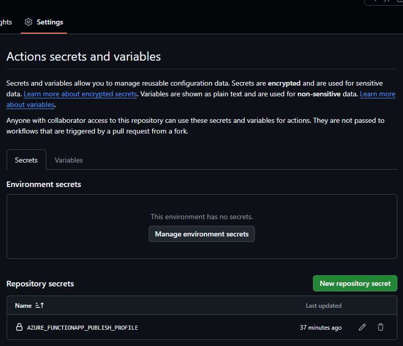
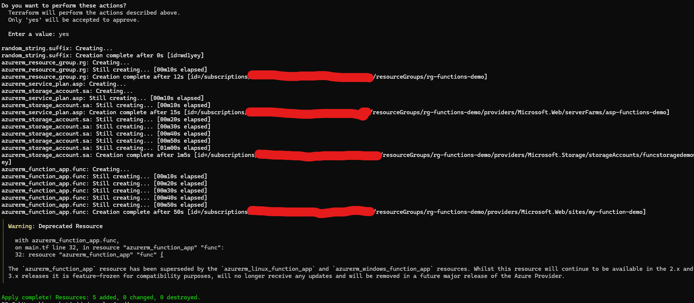
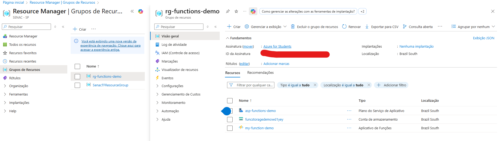
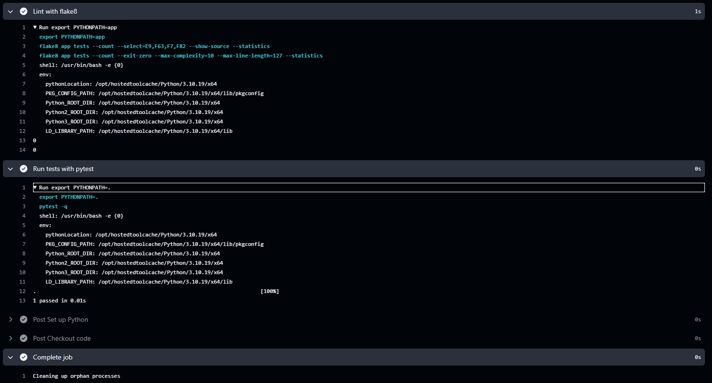
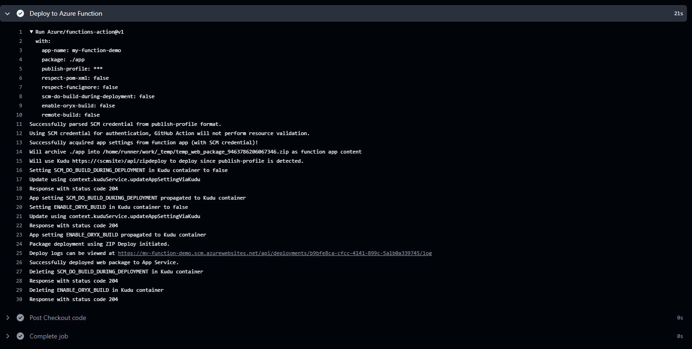
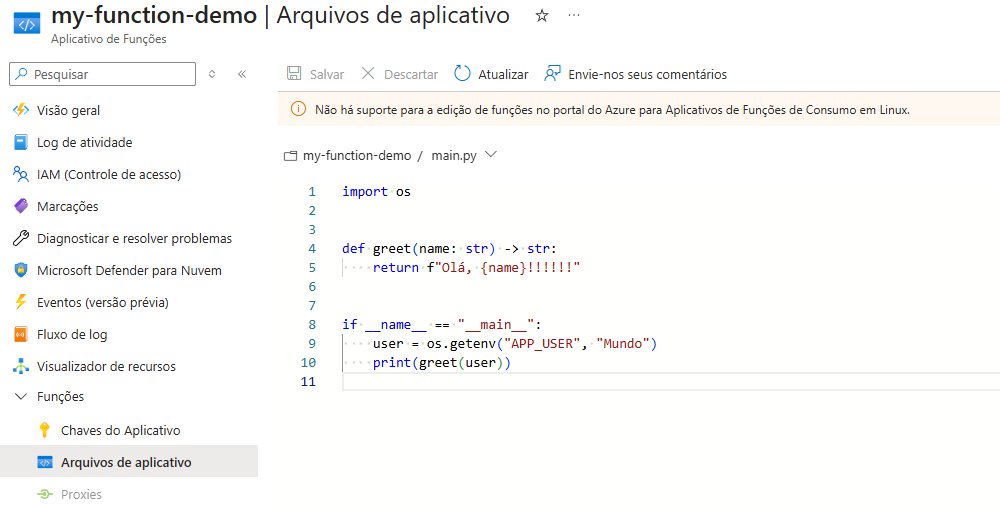
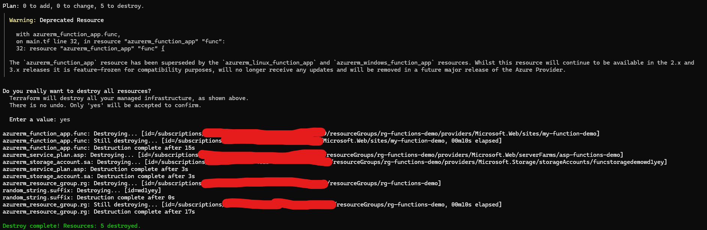
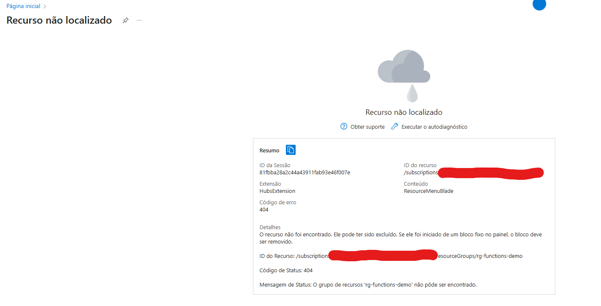

# Aula 06 – Entrega Atividade

Este documento descreve o processo que realizei para criação, teste e deploy de uma Azure Function usando Terraform e GitHub Actions.

## Passo 0: Configuração do Secret no GitHub

Antes de iniciar o deploy, configurei o secret necessário no GitHub Actions para autenticação com a Azure.

**Evidência:**



## Passo 1: Criação da Function com Terraform

Primeiro, criei a infraestrutura necessária na Azure utilizando Terraform. O arquivo `main.tf` define todos os recursos necessários para a Azure Function.

**Evidência:**


## Passo 2: Recursos Criados no Azure

Após a execução do Terraform, verifiquei que os recursos foram criados com sucesso no Azure Portal, incluindo:
- Resource Group
- Storage Account
- App Service Plan
- Function App

**Evidência:**


## Passo 3: Build e Testes com Sucesso

A esteira do Github Actions realizou o build da aplicação e os testes unitários com sucesso. Todos os testes passaram conforme esperado.

**Evidência:**


## Passo 4: Deploy no Azure com Sucesso

O deploy da aplicação foi realizado com sucesso na Azure Function através do GitHub Actions.

**Evidência:**


## Passo 5: Evidência do Código no Azure

Fiz a verificação final mostrando o código da aplicação implantado e funcionando no Azure.

**Evidência:**


## Passo 6: Destruindo a Infraestrutura com Terraform

Após validar o funcionamento completo da aplicação, executei o comando `terraform destroy` para remover todos os recursos criados na Azure.

**Evidência:**


## Passo 7: Evidência de Remoção no Azure

Confirmação no Azure Portal de que todos os recursos foram removidos com sucesso.

**Evidência:**


---

## Comandos Úteis

### Ambiente Virtual Python
```bash
# Criar e ativar venv
python -m venv .venv
source .venv/bin/activate  # Windows: .venv\Scripts\activate

# Instalar dependências
python -m pip install --upgrade pip
pip install -r requirements.txt
pip install -r requirements-dev.txt

# Executar testes
pytest -q
```

### Terraform
```bash
# Inicializar Terraform
terraform init

# Planejar mudanças
terraform plan

# Aplicar infraestrutura
terraform apply

# Destruir recursos
terraform destroy
```

### Executar Aplicação Localmente
```bash
python app/main.py
```
